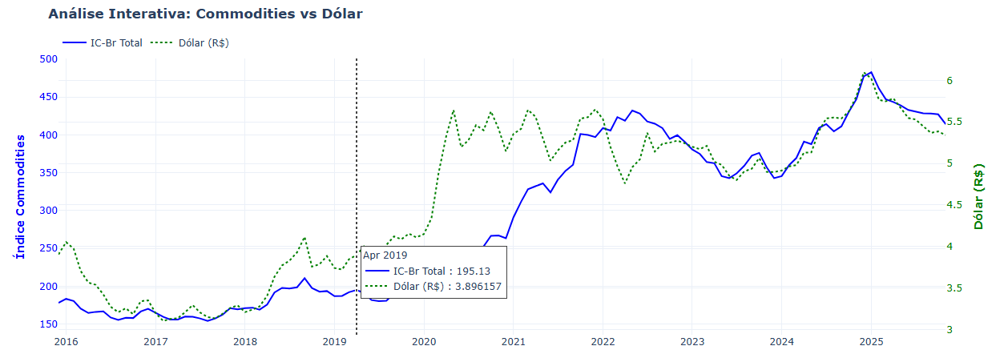

# Monitoramento Macroeconômico de Commodities (IC-Br) vs. Dólar

[](https://nbviewer.org/github/raphamaster/ic-br/blob/main/notebooks/Analise_ICBr.ipynb)

Este projeto consiste em uma análise de dados ponta a ponta (ETL, Análise Exploratória e Visualização) para investigar a correlação entre o **Índice de Commodities Brasil (IC-Br)** e a taxa de câmbio **(USD/BRL)**. 

O objetivo é entender como a volatilidade cambial e os choques de oferta globais impactaram os preços das matérias-primas no Brasil nos últimos anos.


## Visualização do Projeto

> **[Clique aqui para ver o Gráfico Interativo (HTML)](output/grafico_commodities_dolar.html)**
> *(Certifique-se de baixar o arquivo ou visualizá-lo em um navegador)*




## Principais Insights de Negócio

Com base na análise da série histórica (2015-Presente), destacam-se:

1.  **O "Rali" da Pandemia (2020-2022):** A análise visual evidencia um descolamento agressivo dos preços a partir de março de 2020. A combinação de quebra nas cadeias de suprimento globais com a desvalorização do Real criou um cenário de "tempestade perfeita" para a inflação de custos.
2.  **Sensibilidade Cambial (Metais):** A matriz de correlação revelou que o subíndice de **Metais** possui a maior correlação positiva com o Dólar (> 0.70 em diversos períodos), indicando que este setor é o mais exposto à volatilidade cambial imediata.
3.  **Volatilidade Energética:** O setor de **Energia** apresentou os picos de variação mais bruscos, descolando-se frequentemente do índice Agro, o que sugere dinâmicas geopolíticas (ex: OPEP, conflitos) influenciando mais que a demanda interna.


## Ferramentas

* **Linguagem:** Python 3.9
* **Ambiente:** Docker & Jupyter Lab (Containerização para reprodutibilidade)
* **Fonte de Dados:** API do Banco Central do Brasil (`python-bcb`) - SGS
* **Bibliotecas Principais:**
    * `Pandas`: Manipulação e tratamento de Time Series (Resampling, Merges).
    * `Plotly`: Criação de visualizações interativas para web.
    * `Seaborn/Matplotlib`: Visualizações estáticas e estatísticas.


## Estrutura do Repositório

```text
/analise-commodities
│
├── 📂 data/                  # Dados brutos (CSVs de backup)
├── 📂 notebooks/             # Jupyter Notebooks com o código da análise
│   └── Analise_ICBr.ipynb    # Notebook Principal
├── 📂 output/                # Resultados gerados (HTMLs, Imagens)
├── docker-compose.yml        # Orquestração do ambiente
├── requirements.txt          # Dependências do Python
└── README.md                 # Documentação do projeto
```

## Como Executar o Projeto
Este projeto utiliza Docker para garantir que o ambiente seja executado exatamente da mesma forma em qualquer máquina, sem conflitos de dependências.

Pré-requisitos
Docker e Docker Compose instalados.

Passo a Passo
Clone o repositório:

```bash
git clone [https://github.com/raphamaster/analise-commodities.git]
cd analise-commodities
```

### Suba o ambiente:
```bash
docker-compose up -d
```

### Acesse o Jupyter Lab:

Abra o navegador em: http://localhost:8888

Caso peça um token, verifique os logs no terminal: 
```bash
docker-compose logs -f
```

### Execute a Análise:

Navegue até a pasta notebooks/ e abra o arquivo Analise_ICBr.ipynb.

Execute todas as células para gerar os dados atualizados e os gráficos.

## Visualização do Projeto

Abaixo, uma demonstração da interatividade da análise, permitindo correlacionar os picos do Dólar com a alta das Commodities:


> **[Clique aqui para ver o Gráfico Interativo completo (HTML)](output/grafico_commodities_dolar.html)**